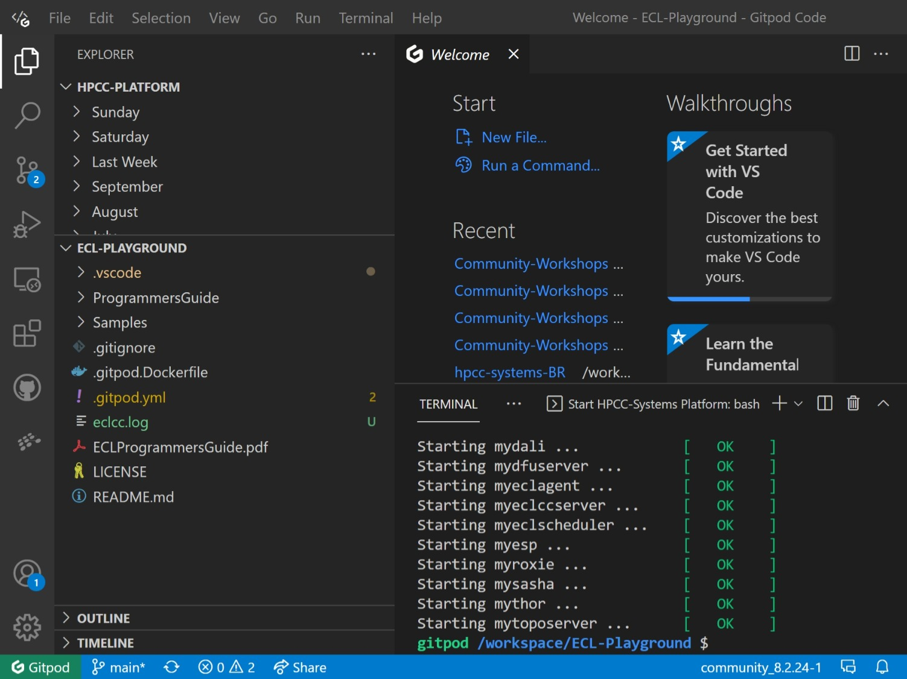
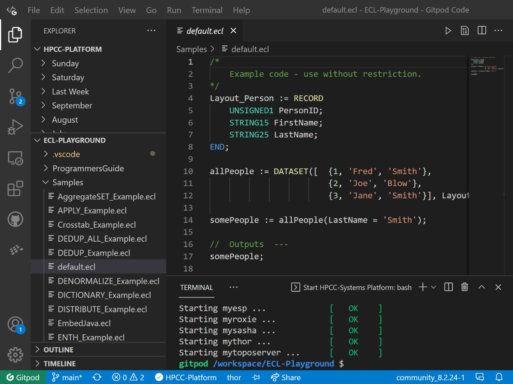
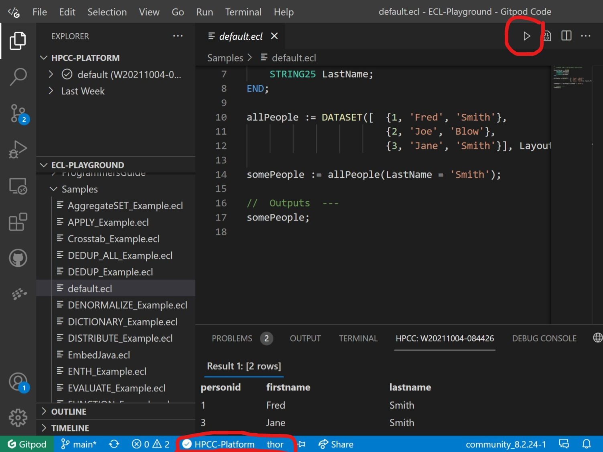
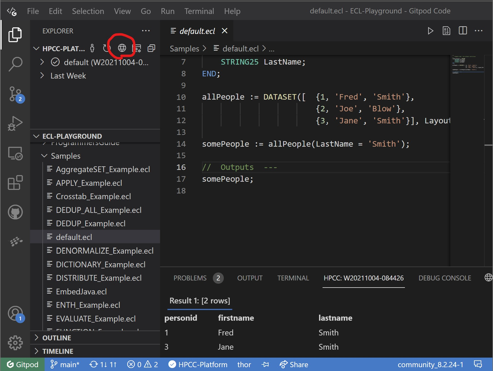
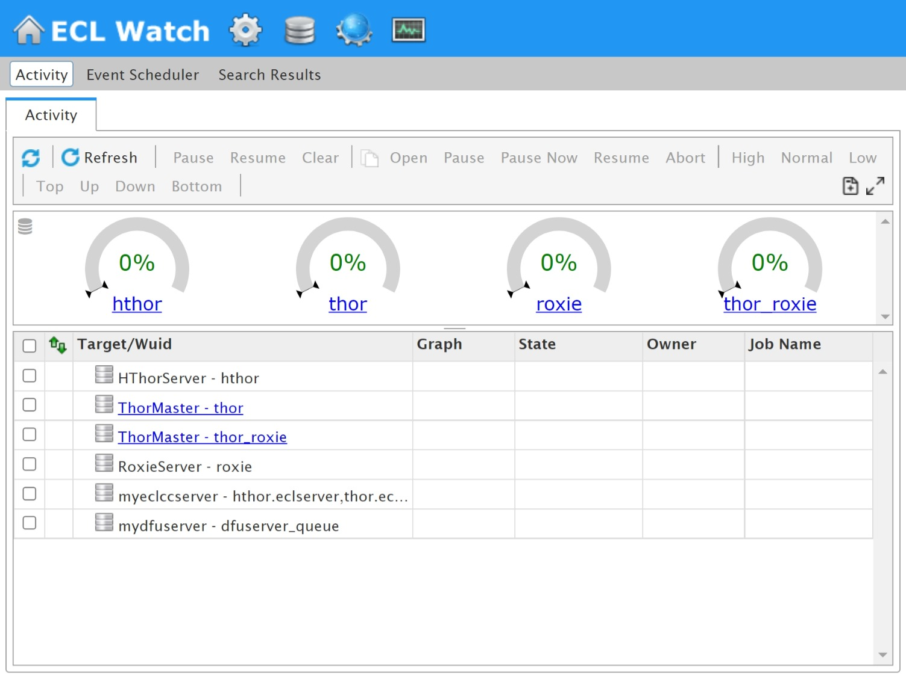

# ECL-Playground

ECL Playground for the HPCC-Systems big data Platform.  This demo utilises cloud developer environments (originally [Gitpod](https://gitpod.io), now also [GitHub Codespaces](https://github.com/features/codespaces)) to host a single node instance of the HPCC-System Platform and VS Code (web based) with the ECL Extension pre-installed.

## Launch in GitHub Codespaces

Click the badge below to launch a Codespace using the new dev container configuration.

The Codespaces environment will:

* Build a custom container (see `.devcontainer/Dockerfile`) installing HPCC Systems Platform 9.2.2-1
* Auto-start the HPCC services (`postStartCommand` runs `start-hpcc.sh`)
* Forward port `8010` (ECL Watch) automatically opening it in a browser
* Install the VS Code extensions: `hpcc-systems.ecl` and `gordonsmith.observable-js`

### Codespaces Notes

* If the HPCC services fail to start (rare), run: `start-hpcc.sh` in the integrated terminal.
* To rebuild the container after changing devcontainer files: Command Palette → “Codespaces: Rebuild Container”.
* The legacy Gitpod config (`.gitpod.yml`) remains for backward compatibility; future improvements should target the dev container.

---

## Launch Environment

_select which environment you want to launch_

### Latest Version from "main" branch:

* [main](https://gitpod.io/#https://github.com/GordonSmith/ECL-Playground)

### Specific Platform Versions:

* [hpcc-platform-9.2.2-1](https://gitpod.io/#https://github.com/GordonSmith/ECL-Playground/tree/hpcc-platform-9.2.2-1)
* [hpcc-platform-8.6.28-1](https://gitpod.io/#https://github.com/GordonSmith/ECL-Playground/tree/hpcc-platform-8.6.28-1)
* [hpcc-platform-8.4.12-1](https://gitpod.io/#https://github.com/GordonSmith/ECL-Playground/tree/hpcc-platform-8.4.12-1)

## Quick Start

* Expand the "Samples" folder and click on "default.ecl"

1.  Check the environment and target
2.  Click on the submit button

* Open ECL Watch by clicking on the globe

